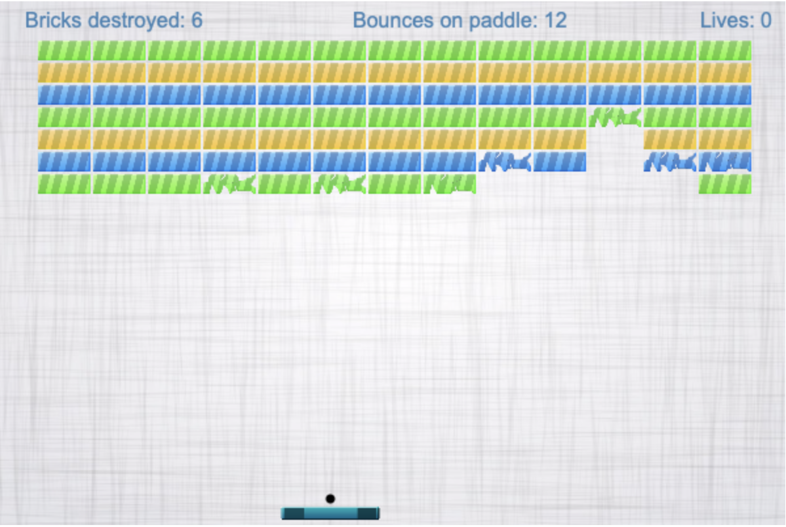
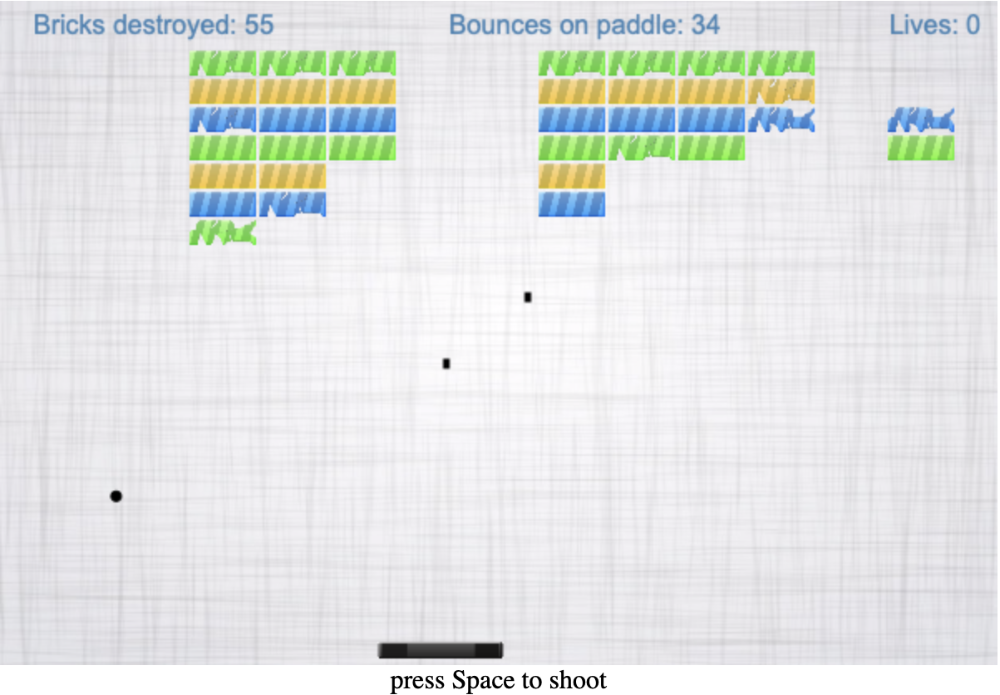
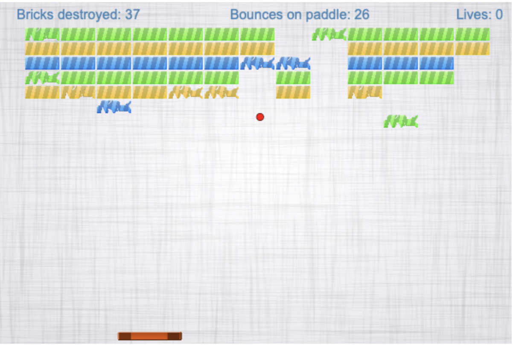
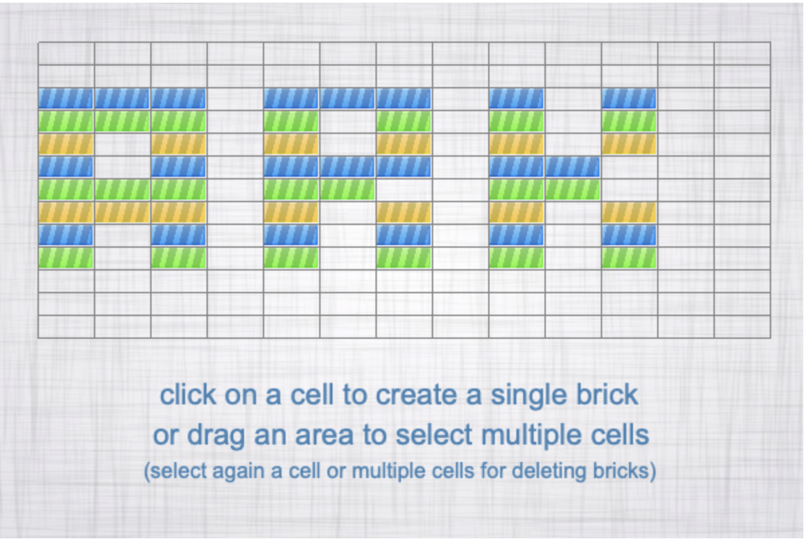
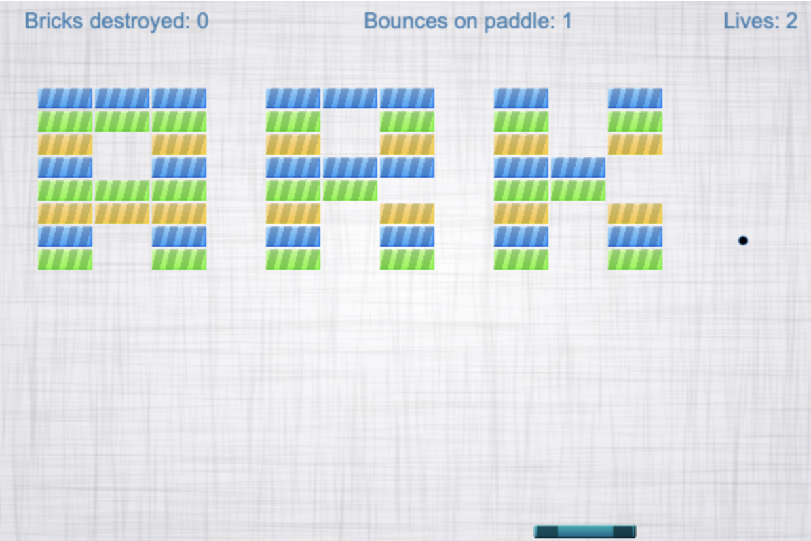

# Arkanoid

An implementation of the famous game from the past. With *scores*, *power-ups*, *lifes* and even a ***level editor***.

## The game

The point of the bounce on paddle determine the outcoming angle of the ball (as if it were spherical).\
Every brick needs three impact to be fully destroyed.
You gain points for each brick hitted, and you lose them every bounce on bar.

## Power-ups

Catch the star for getting extra powers. Hurry up! These powers will last for a limited time.

### Machine gun

Black star will give you shooting power and your bar will became black. Use the `space bar` to shoot. Unlimited fire power for the time window of three bounce on paddle.

### Heavy ball

Red star will give your ball extra weight for destroying bricks at first hit, without bouncing back. Use it for smashing bricks in a row.

## Levels editor

|  |  |
|:--:|:--:|

Select single cell of the grid for making bricks appearing, or drag an area to select multiple cells.\
Select bricks again for deleting them.
That's it, you are now ready to play the level you have just created!

Try [it](http://sintetik.altervista.org) now!
